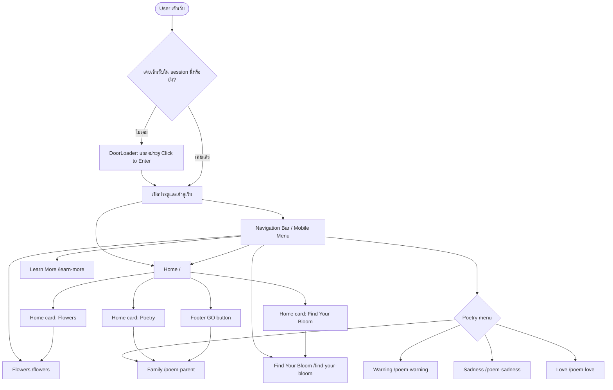
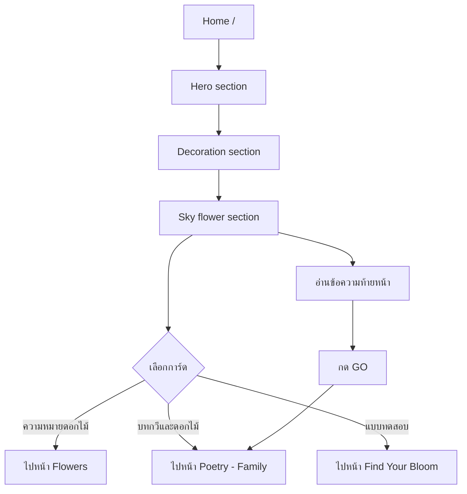
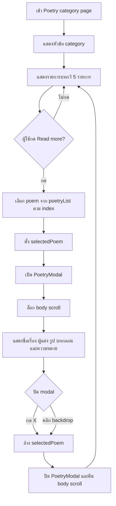
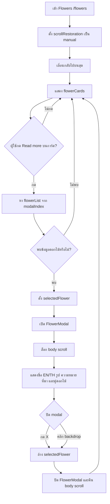
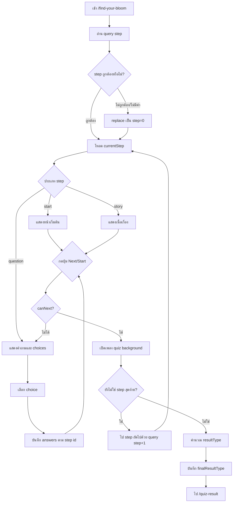
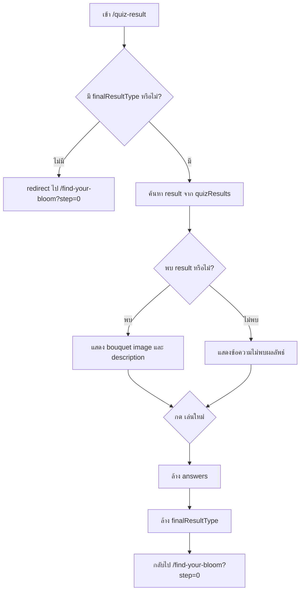
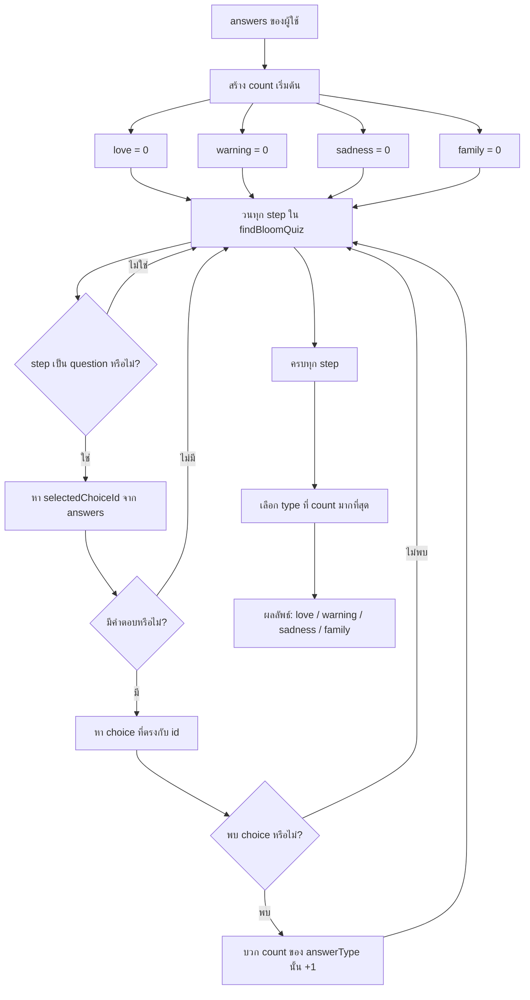

# Website Flow Charts

เอกสารนี้สรุป flow หลักของเว็บจากโค้ดใน `app/pages`, `app/components`, `app/layouts` และ `app/data` สามารถนำ Mermaid diagram ไปวางใน Markdown viewer ที่รองรับ Mermaid ได้ทันที

## 1. Overall Site Map



## 2. Home Page User Flow



## 3. Navigation Flow

```mermaid
flowchart TD
  A[NavigationBar desktop] --> B{เมนูที่เลือก}
  A2[MobileMenu mobile] --> B

  B -- HOME --> H[/]
  B -- FLOWERS --> F[/flowers]
  B -- FIND YOUR BLOOM --> Q[/find-your-bloom]
  B -- LEARN MORE --> L[/learn-more]
  B -- POETRY --> P{เปิด dropdown/submenu}

  P -- FAMILY --> PF[/poem-parent]
  P -- WARNING --> PW[/poem-warning]
  P -- SADNESS --> PS[/poem-sadness]
  P -- LOVE --> PL[/poem-love]

  PF --> M[PoetryHero แสดงเฉพาะ poem-* และ flowers]
  PW --> M
  PS --> M
  PL --> M
  F --> M
```

## 4. Poetry Page Flow

ใช้ร่วมกันกับหน้า `poem-parent`, `poem-warning`, `poem-sadness` และ `poem-love`



## 5. Flowers Page Flow



## 6. Find Your Bloom Quiz Flow ถึงตรงนี้



## 7. Quiz Result Logic



## 8. Quiz Scoring Flow



หมายเหตุ: ถ้าคะแนนเท่ากัน ระบบจะเลือกตามลำดับใน `answerTypes` คือ `love`, `warning`, `sadness`, `family` เพราะใช้ `reduce` และเปลี่ยนค่าเฉพาะเมื่อคะแนนมากกว่าเท่านั้น

## 9. Modal State Flow

```mermaid
stateDiagram-v2
  [*] --> Closed
  Closed --> Open: click Read more
  Open --> Open: display selected data
  Open --> Closed: click X
  Open --> Closed: click backdrop

  state Open {
    [*] --> BodyScrollLocked
    BodyScrollLocked --> ContentVisible
  }

  Closed: selectedPoem/selectedFlower = null
  Closed: body overflow restored
  Open: selectedPoem/selectedFlower has data
  Open: body overflow hidden
```

## 10. Important Routes

| Route | Purpose |
| --- | --- |
| `/` | หน้าแรกและทางเข้าไปยัง flow หลัก |
| `/poem-parent` | Poetry category: Family |
| `/poem-warning` | Poetry category: Warning |
| `/poem-sadness` | Poetry category: Sadness |
| `/poem-love` | Poetry category: Love |
| `/flowers` | รายการดอกไม้และ Flower modal |
| `/find-your-bloom` | แบบทดสอบแบบ step-by-step |
| `/quiz-result` | แสดงผลลัพธ์จากแบบทดสอบ |
| `/learn-more` | หน้าเนื้อหาให้ความรู้เพิ่มเติม |
