# Website Flow Charts

เอกสารนี้สรุป flow หลักของเว็บจากโค้ดใน `app/pages`, `app/components`, `app/layouts`, `app/composables` และ `app/data`
โดยอัปเดตให้ครอบคลุมระบบ Find Your Bloom แบบสองภาษา, หน้า result ตามภาษา, เพลงประกอบ quiz, modal ดอกไม้ที่ปรับรูปได้รายรายการ และ flow หน้า home ปัจจุบัน

## 1. Overall Site Map

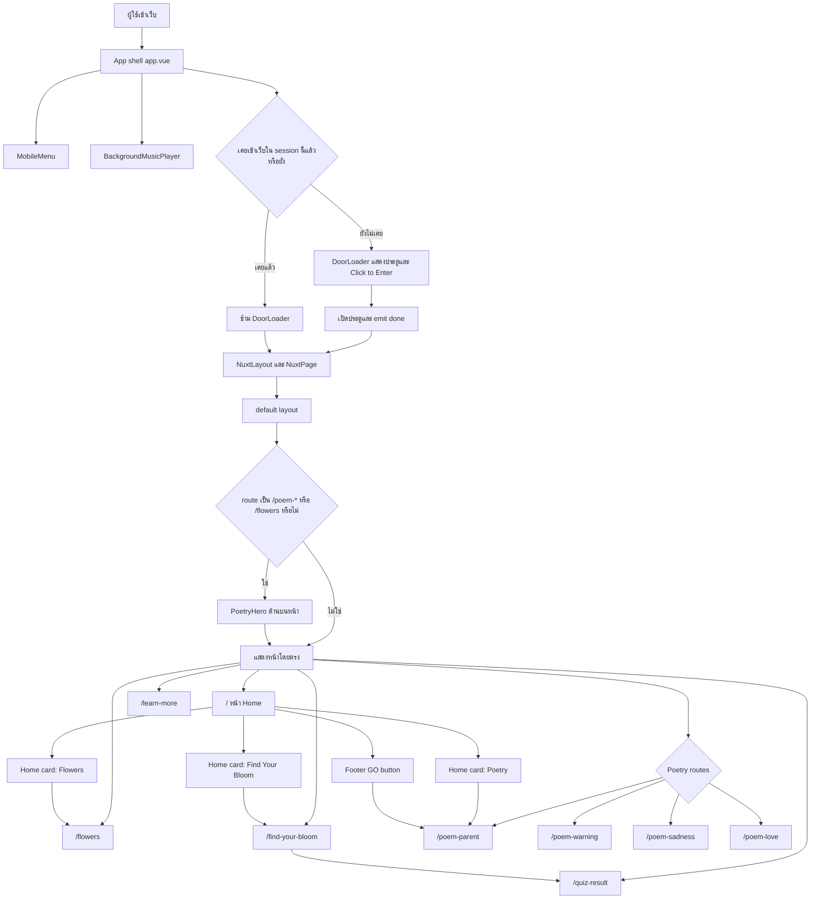

## 2. App Shell Flow

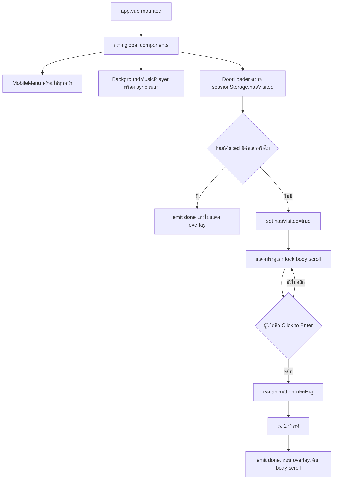

## 3. Home Page User Flow

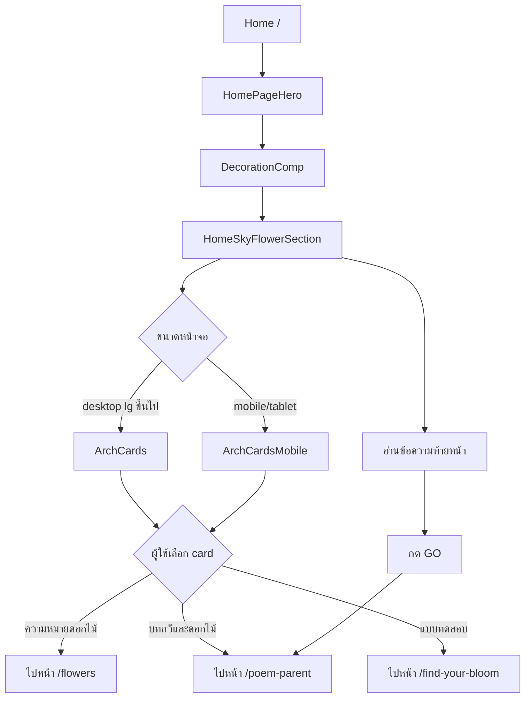

หมายเหตุการแสดงผลล่าสุด:

| จุดที่ปรับ | ผลต่อ flow |
| --- | --- |
| `HomePage-hero.vue` | รูป title รองรับ viewport เล็กมากขึ้นด้วย breakpoint `min-[20px]` |
| `DecorationComp.vue` | รูปผีเสื้อถูกยก z-index เพื่อให้ลอยเหนือ section |
| `HomeSkyFlowerSection.vue` | ลด font clamp ขั้นต่ำของข้อความ เพื่อกันข้อความล้นบนจอเล็ก |

## 4. Navigation Flow

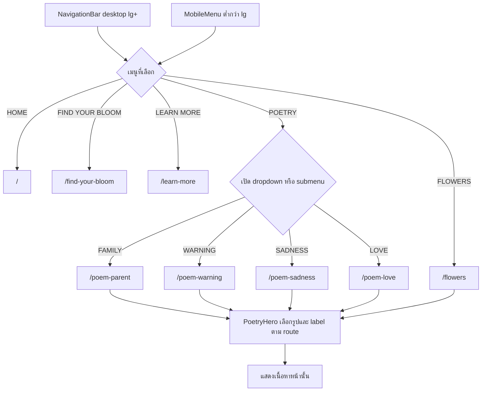

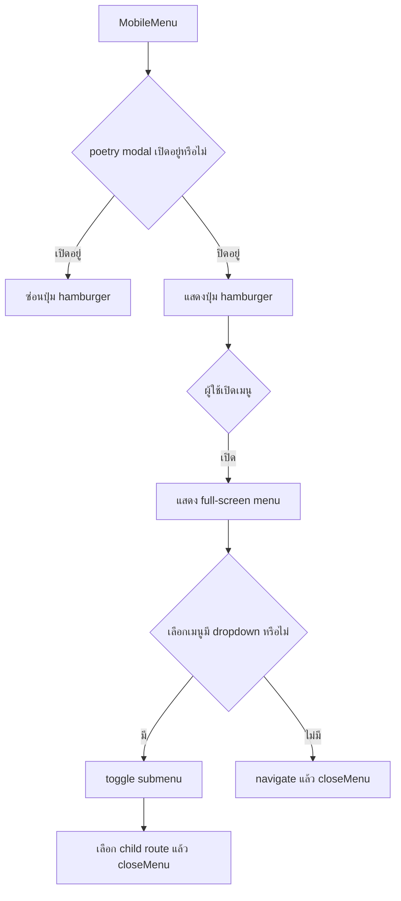

## 5. Poetry Page Flow

ใช้ร่วมกับ `poem-parent`, `poem-warning`, `poem-sadness` และ `poem-love`

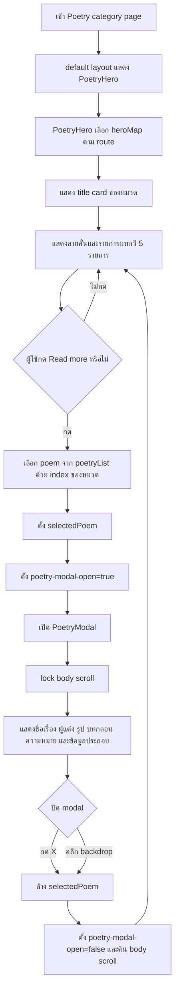

## 6. Flowers Page Flow

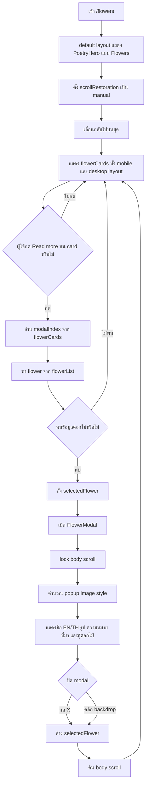

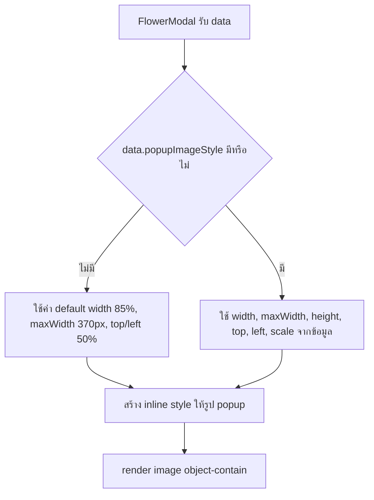

ตัวอย่างข้อมูลที่เพิ่มล่าสุด: `Azalea Flower` ตั้ง `popupImageStyle.width` เป็น `200%` และ `maxWidth` เป็น `530px` เพื่อให้รูปใน modal มีขนาดเหมาะกับภาพจริง

## 7. Find Your Bloom Quiz Flow

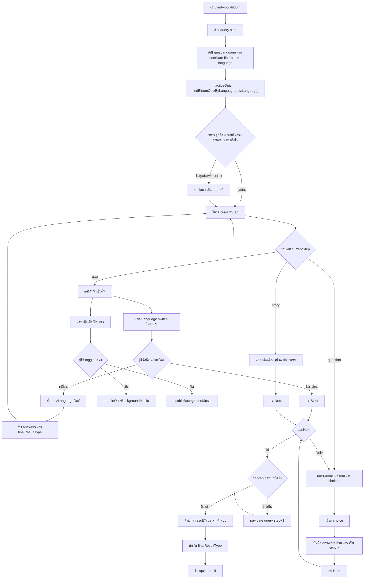

ข้อมูลภาษาปัจจุบัน:

| State/Data | หน้าที่ |
| --- | --- |
| `quizLanguages` | จำกัดภาษาที่รองรับเป็น `th` และ `en` |
| `findBloomQuiz` | ชุดคำถามภาษาไทย |
| `findBloomQuizEn` | ชุดคำถามภาษาอังกฤษ |
| `findBloomQuizByLanguage` | map ภาษาไปยัง quiz step ที่ใช้งานจริง |
| `find-bloom-language` | state กลางที่หน้า quiz และหน้า result ใช้ร่วมกัน |

## 8. Quiz Scoring Flow

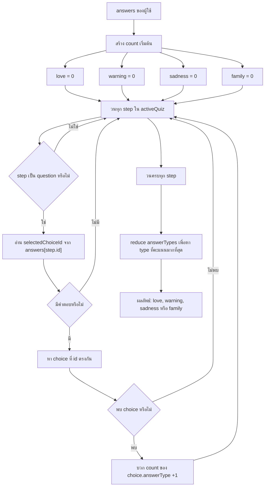

หมายเหตุ: ถ้าคะแนนเท่ากัน ระบบจะเลือกตามลำดับใน `answerTypes` คือ `love`, `warning`, `sadness`, `family`
เพราะ logic เปลี่ยนผู้ชนะเฉพาะตอนที่คะแนนของ type ใหม่มากกว่าคะแนนเดิมเท่านั้น

## 9. Quiz Result Flow

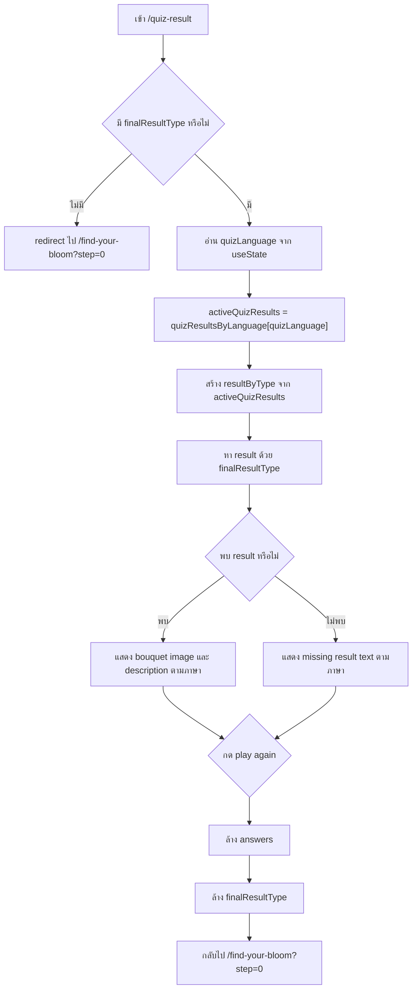

ข้อมูล result ปัจจุบัน:

| State/Data | หน้าที่ |
| --- | --- |
| `quizResults` | คำอธิบายผลลัพธ์ภาษาไทย |
| `quizResultsEn` | คำอธิบายผลลัพธ์ภาษาอังกฤษ |
| `quizResultsByLanguage` | map ภาษาไปยัง result data |
| `resultPageText` | เปลี่ยนข้อความปุ่มและข้อความ error ระหว่างไทย/อังกฤษ |

## 10. Background Music Flow

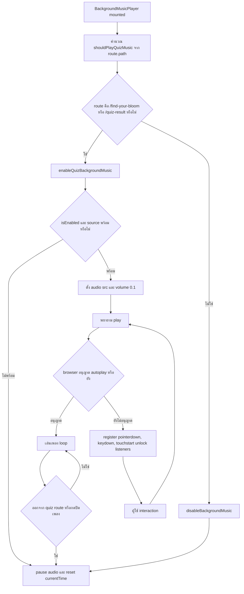

## 11. Modal State Flow

```mermaid
stateDiagram-v2
  [*] --> Closed
  Closed --> Open: click Read more
  Open --> Open: display selected data
  Open --> Closed: click X
  Open --> Closed: click backdrop

  state Open {
    [*] --> BodyScrollLocked
    BodyScrollLocked --> ContentVisible
  }

  Closed: selectedPoem/selectedFlower = null
  Closed: body overflow restored
  Open: selectedPoem/selectedFlower has data
  Open: body overflow hidden
```

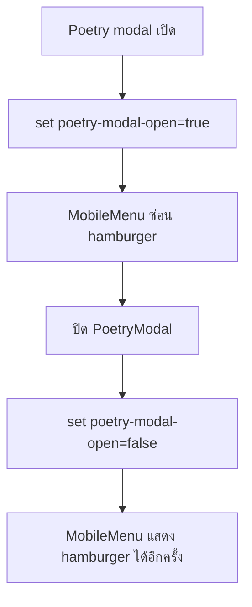

## 12. Data Relationships

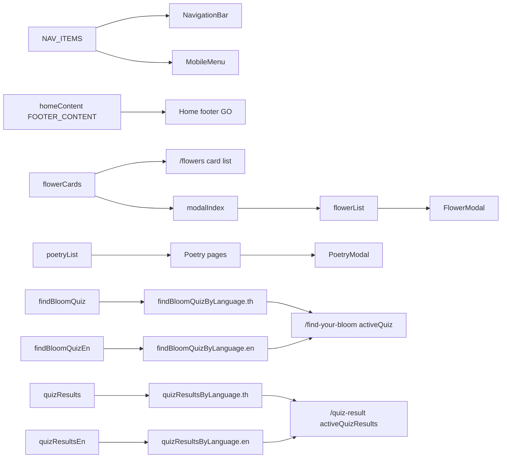

## 13. Important Routes

| Route | Purpose |
| --- | --- |
| `/` | หน้าแรกและทางเข้าไปยัง flow หลัก |
| `/poem-parent` | Poetry category: Family |
| `/poem-warning` | Poetry category: Warning |
| `/poem-sadness` | Poetry category: Sadness |
| `/poem-love` | Poetry category: Love |
| `/flowers` | รายการดอกไม้และ Flower modal |
| `/find-your-bloom` | แบบทดสอบ Find Your Bloom แบบ step-by-step รองรับไทย/อังกฤษ |
| `/quiz-result` | แสดงผลลัพธ์ bouquet ตามคะแนนและภาษาที่เลือก |
| `/learn-more` | หน้าเนื้อหาความรู้เพิ่มเติม |
